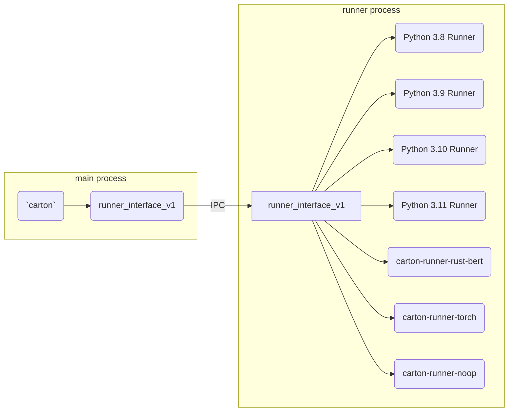
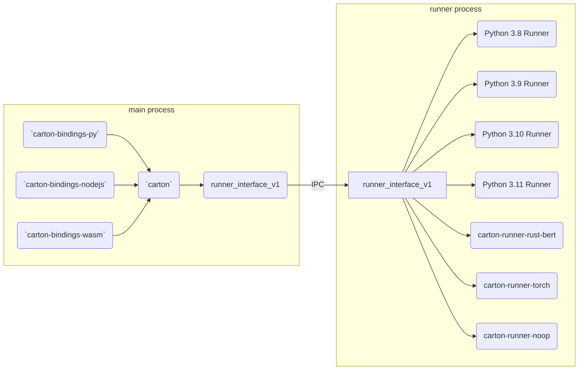
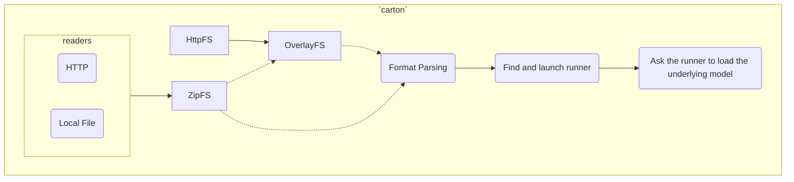

This document provides an overview of how Carton works and how the codebase is structured. We'll build up an architecture diagram component by component as the document progresses.

# Overview

Carton is a library that lets users run any machine learning model from any programming language (aspirationally). It does this by presenting a uniform interface for several different ML frameworks.

It has three main components which will be discussed more below:

* A core library implemented in Rust
* *runners* that support different ML frameworks
* *bindings* that support different programming lanuages

Take a look at https://carton.run before continuing as the rest of the document assumes some basic knowledge about what Carton is.

# Carton model format

A carton model (or a "carton" for short) is a zip file with the original model and some metadata. The original underlying model is *NOT* modified. Under the hood, models are run with their original framework (e.g. a TorchScript model is run with libtorch).

See [docs/specification/format.md](docs/specification/format.md) for details on the format.

Note: It may be helpful to read the rest of this architecture doc for context before looking at the format details.

# ML framework support

Each ML framework is supported by a _runner_. This is a component that knows how to run and package a model for a particular version of a particular framework. Each supported framework and version of that framework has its own runner.

For example:

- The Python 3.8 runner knows how to package and run arbitrary python code with Python 3.8
- The TorchScript 2.0.1 runner knows how to package and run TorchScript models with libtorch 2.0.1

Each runner is implemented in `source/carton-runner-*`

The packaging portion of a runner can do framework-specific work (e.g. a Python runner can generate a lockfile from a requirements.txt). The generic portions of packaging are handled by the core library.

Runners are independent binaries that are executed in their own process. This makes it easy to isolate models and frameworks from each other. However, this also means that they have to know how to communicate with the core Carton library. This is where the "runner interface" comes in.

### Runner interface

The runner interface is a library that implements a communication protocol that allows the core library and the runners to communicate.

A runner is built against one version of the runner interface. The core library supports *all* versions of the interface.

This allows runner binaries from old releases to run correctly with new versions of the core library.

The current version of the interface is implemented in `source/carton-runner-interface`

### Runner installation

Runners are dynamically fetched and installed as necessary. See the link below for more details

The relevant code is at `source/carton-runner-packager`

See [docs/specification/runner.md](docs/specification/runner.md) for more details on runner packaging, discovery, and installation.

# Programming language bindings

Carton is implemented as a core library in Rust with bindings to other languages. Each language binding is implemented in its own crate under `source/carton-bindings-*`.

# Core library

The core library is implemented in `source/carton`.

This library is responsible for working with the runners and the `carton-runner-packager` crate to do several things:

* Load models
* Pack models
* Discover and install runners
* Cache various parts of the process

## Loading models

### Loading models from various sources

We want to be able to load models from several sources (e.g. local files on disk, URLs, etc.), but we don't want all components to be concerned with the details of this.

As such, Carton uses a filesystem abstraction/interface called [Lunchbox](https://github.com/VivekPanyam/lunchbox). Most of the library (including the runners) only deal with Lunchbox filesystems. This lets us transparently support various formats and protocols without infecting the whole application with details.

There are two parts to getting data from a model:

* Reading bytes from the carton model file itself (e.g. from disk, from a URL, etc.)
* Loading files from a container format (e.g. zip files)

#### Reading bytes from the model file

Concretely, this means we need a readable and seekable stream. We currently implement this for [HTTP URLs](source/carton/src/http.rs) (by using range requests) and for local files.

This also means we can easily support new protocols (e.g. FTP, torrent, etc). Basically any protocol that can give us a readable and seekable stream should work.

#### Loading files from a container format

As carton models are just zip files, we use the [ZipFS](https://github.com/VivekPanyam/ZipFS) filesystem with Lunchbox to expose model contents to the rest of the library.

ZipFS can operate on top of any readable and seekable stream so this works well with the component described above.

Importantly, this means we can load carton models from many sources *without downloading the entire model*. If you just want to fetch metadata, we can do that by only fetching the relevant sections of the zip file.

In fact, this is how https://carton.pub works.

### Carton format parsing

The core library also implements parsing of the carton file format.

See [docs/specification/format.md](docs/specification/format.md) for details on the format and `source/carton/src/format` for the implementation.

### LINKS

Storing a large number of models can be inefficient if there are many duplicated files. To resolve this, we support a `LINKS` file within cartons. This is a file that enables a carton model to store URLs to a file instead of the file itself (concretely, a mapping from sha256 to a list of URLs).

See the `LINKS` section of [docs/specification/format.md](docs/specification/format.md) for more details.

This is implemented as a Lunchbox [HTTP filesystem](source/carton/src/httpfs.rs) combined with a Lunchbox [overlay filesystem](source/carton/src/overlayfs.rs).

With all of this put together, we can transparently resolve linked files.

This is an overview of what loading models looks like:

See `source/carton/src/load.rs` for more details.

## Packing models

The core library interacts with runners in order to package a model. This also uses a Lunchbox filesystem.

At a high level, the steps are:

1. Find and launch the appropriate runner
2. Ask the runner to process the user provided model and return a directory to pack
    - The runner may do things like generating lockfiles, etc if necessary
3. Save the returned directory using the carton file format

# More Info

Take a look at `source/README.md` for a list of all the crates in Carton and a short description of each one.