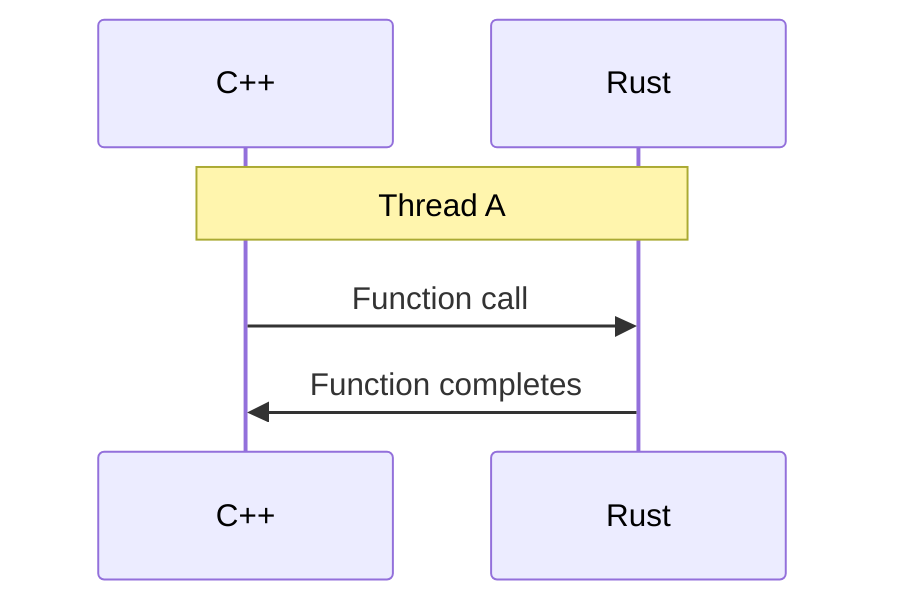
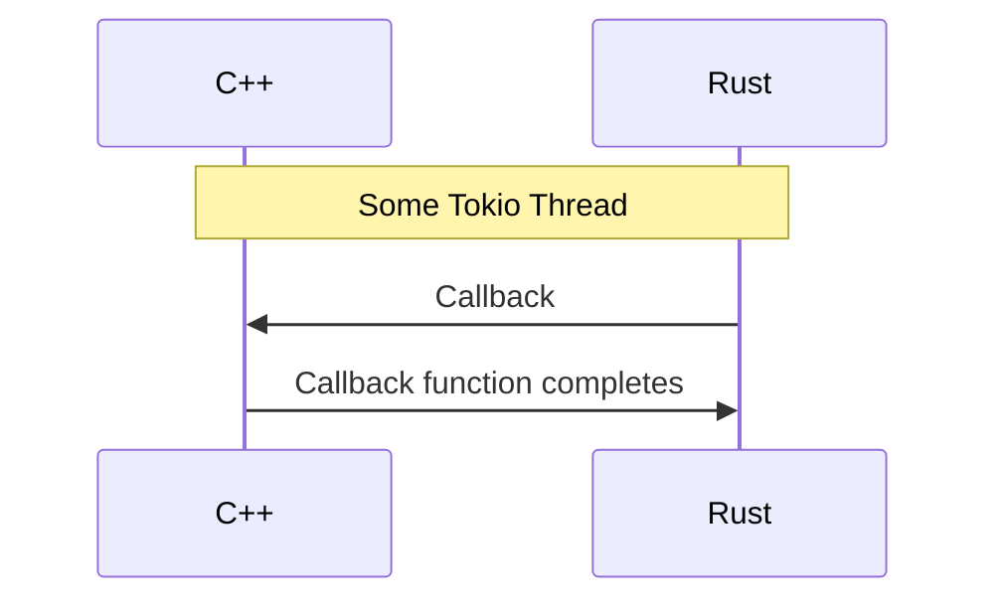

These bindings allow users to use Carton from C++.

The implementation is in `src/`. See the `.cc` files in `tests/` for complete examples of usage.

The C++ bindings are implemented on top of the C bindings and contain no Rust code.

The rest of the doc talks about the design of the bindings and the rationale for some choices.

## Why not use cxx?

### 1. It doesn't support passing functions from C++ to Rust.

At the time of writing, it only supports passing functions the other way. We could work around this by passing a `void*` and then casting, but then we'd need to write wrapper C++ code on top of the generated code to present the correct API to the user.

### 2. We can't instantiate C++ templates (other than a few built-in ones)

This makes using `std::future`, `std::optional`, `std::variant`, and `std::unordered_map` much more complex.
Also we can't define templated types like `AsyncNotifier` or `Result`

### 3. Using it would cause extra copies with strings (or require additional wrapper code).

`cxx` supports several string mappings (Rust `String`s to C++ with `rust::String`, C++ `std::string`s to Rust using `CxxString`, Rust `&str` to C++ with `rust:Str`, etc.).

Unfortunately, in several cases, we want a `&str` as input in Rust, but we don't want to expose `rust::Str` to users
because that doesn't feel like it "belongs" in C++ and we want bindings to feel like part of the target language.

Fixing this would mean writing C++ wrapper code or bindings to accept `std::string_view`.

### 4. It converts Rust `Result`s into C++ exceptions.

It may be preferable to return a status/result to C++ that allows users to more cleanly handle recoverable/retryable issues.
This one could go either way, but if we directly implement it, we have a choice.

So if we need to write wrapper C++ code on top of the autogenerated `cxx` code to address 1, 2, and 3 above
(including workarounds/hacks for 1 and 2), we might as well just implement idiomatic C++ bindings on top of the C API.

## Details on async

The core of Carton is implemented in Rust and uses an async runtime called [Tokio](https://tokio.rs/). As a large portion of Carton's Rust interface is async, we would like to expose an async interface to C++. For reasons that aren't particularly important for the purposes of this doc, it's not practical to integrate an async Rust runtime with a C++20 coroutine library in a way that they share one event/executor system.

Instead, we want to notify C++ callers when an async function/task has completed on the Rust side. There are a few options discussed below.

### Callbacks

Consider the situation where a C++ function calls an async Rust function on a user-owned `Thread A`. For the case of callbacks, let's assume the function response is empty. That would look something like this:

Within Rust code, the work is dispatched to a Tokio runtime thread because it must quickly return control of `Thread A` to the caller's code (to avoid blocking).

At some point, this work is done and we want to notify the caller:

This poses some problems. Most importantly, the user's callback code can block `Some Tokio Thread` for an indefinite amount of time. As a general rule, it's important to avoid doing extended periods of CPU bound work from within an async task as that can block other tasks in the runtime from executing.

Additionally, since the callback is running on a thread the user didn't create/isn't necessarily aware of, it can make their code more complex (if they have thread local state, etc).

We could use [`tokio::task::spawn_blocking`](https://docs.rs/tokio/latest/tokio/task/fn.spawn_blocking.html), which runs code on a thread where it's okay to block, but that still doesn't solve the problem of running callbacks on "opaque" threads.

Callbacks are still useful for integrating with other event systems (see below), but probably should not be our default option.

### `std::future`

This is actually quite similar to callbacks, but we're effectively setting the callback code to be [`std::promise<>::set_value`](https://en.cppreference.com/w/cpp/thread/promise/set_value). This solves both of the above problems (blocking a tokio thread and running user code on "opaque" threads).

Unfortunately, this isn't actually a "notification"; user code has to [poll or wait on a future](https://en.cppreference.com/w/cpp/thread/future).

For many cases, this is okay, but if you have a large number of futures, polling all of them can become expensive. The cost grows roughly linearly with the number of outstanding futures.

We can add a separate notification functionality to solve this problem.

### Notifications

It's valuable for users to be able to say "give me the result of an async task that's ready (if any)" or "wait until a task is ready and give me the result".

This provides a foundation to write efficient, event driven code with Carton in C++.

This is *technically* still something you have to check, but it's constant time rather than linear in the number of outstanding futures.

([Recommended reading](http://www.kegel.com/c10k.html) if this is interesting to you)

See the [C bindings readme](../carton-bindings-c/README.md) for details on integrating with external event loops.