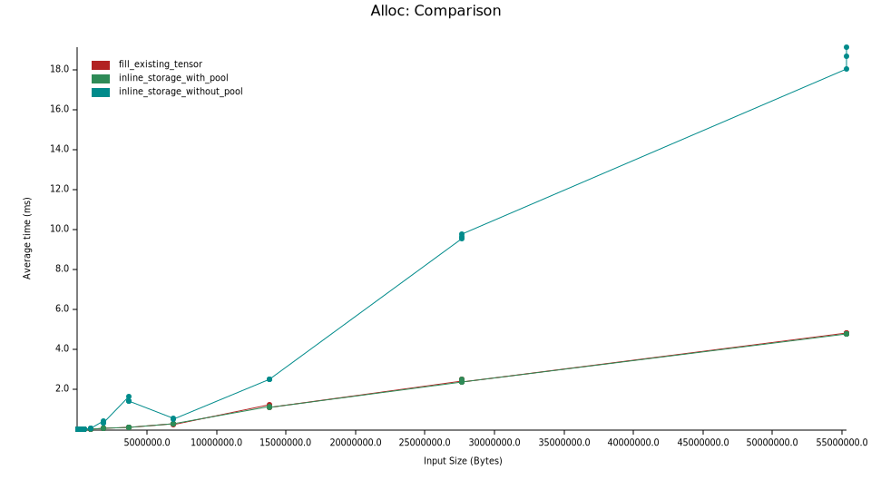
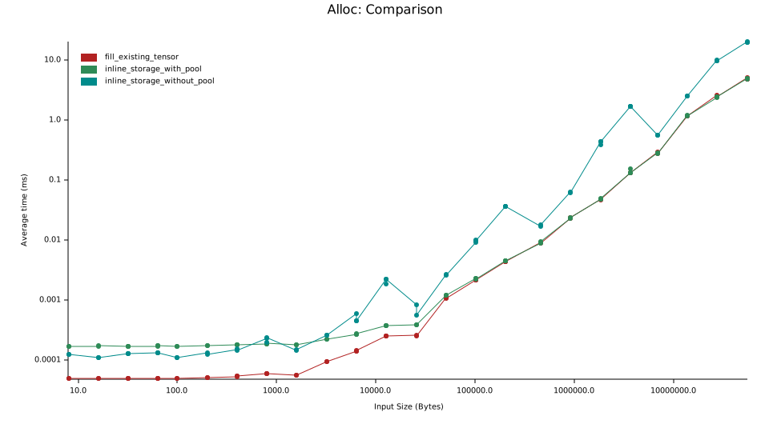
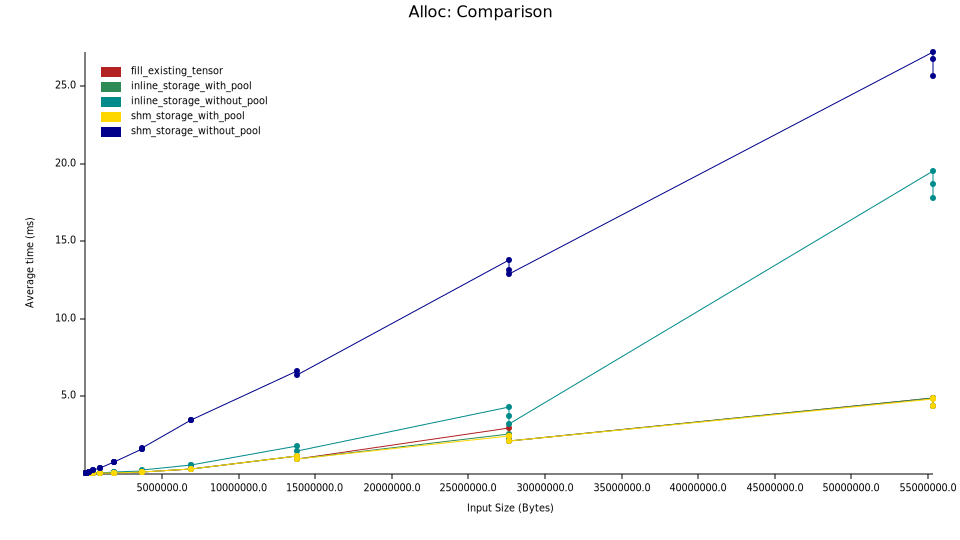
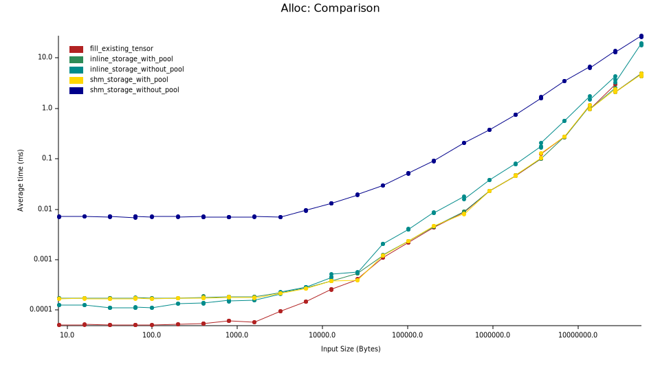

# Benchmark analysis

*Note: this analysis was done on 2/1/23. The results of benchmarks may have varied since then*

**TL;DR: An allocator that reuses previous allocations provides superior performance**

## Overview

This benchmark compares allocators on the following dimensions:
 - Shared memory (`shm_storage`) vs standard allocations (`inline_storage`)
 - Allocation reuse pool (`with_pool`) vs no allocation reuse pool (`without_pool`)

Specificially, these variants are benchmarked:

- Allocating storage for a tensor and filling with a non-default value.
  - (`inline_storage_without_pool` in the plots below)
- Allocating storage for a tensor using a pool of previously allocated and dropped items (falling back to a standard alloc if none are available) and filling with a non-default value.
  - (`inline_storage_with_pool` in the plots below)
- Filling an existing allocation with a non-default value. This is used as a baseline.
  - (`fill_existing_tensor` in the plots below)
- `shm_storage_with_pool` and `shm_storage_without_pool` (similar to the first two variants above)

The purpose of the non-default fill is to ensure that the storage is not lazily allocated (with zero pages, for example). This also allows us to include data access times in the benchmark.

This is a useful benchmark under the following assumption:

- Repeated allocations of the same size/shape are common in inference workloads.

This is generally true for image-based models. Text models and other variable sized models are not currently included in this benchmark. They will be measured in the future.

## Results

As expected, reusing previous allocations leads to significant performance boosts, especially with larger tensors.

As you can see in the plot below, for large allocations (~ HD images), reusing previous allocations is ~14ms faster than allocating a new chunk of memory.

Here's a **log-log** plot of results of the same benchmark. For small allocations, the pool allocator is ~60 nanoseconds slower than the naive one and larger allocations approach the performance of "fill an existing allocation". This implies that the allocation overhead of the pool allocator approaches zero as the sizes increase.

So in the worst case, the pool allocator is 60 *nanoseconds* slower than an allocator without a pool and best case (in this benchmark) it's 14 *milliseconds* faster. Therefore, we enable the pool allocator by default.

## Shared memory

If we add a shared memory implementation (with pool and without pool as above), we get this:

The **log-log** version of that plot is

Shared memory allocations with a pool take roughly the same amount of time as standard memory allocations with a pool. This means that we can enable shared memory storage if it has a significant benefit for serialization performance without hurting allocation performance.

## Future exploration

We should redo this analysis once a LRU cache is implemented within the pool. We should also test on allocation patterns that don't match the "repeated allocation" assumption above to ensure that performance is still good.
